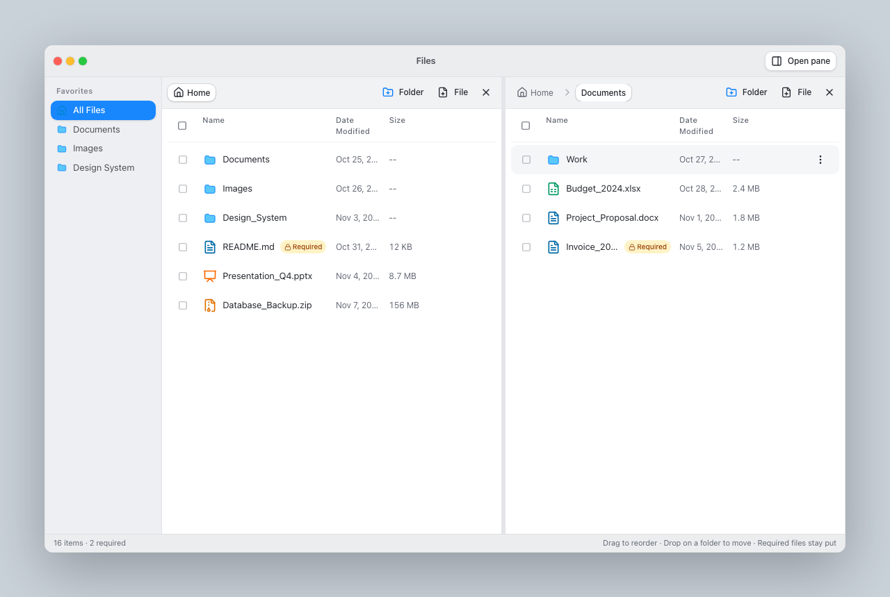

# React Modern Drag and Drop

> Dual-pane file explorer with accessible drag & drop — built as a portfolio piece that shows how I think about hard UI problems, not just how I render them.

**React 19 · TypeScript (strict) · Vite 8 · Tailwind CSS 4 · dnd-kit · Zustand · Vitest · Playwright**



---

## Author

### Alghisi Alessandro Paolo

Senior Software Engineer · Cluj-Napoca, Romania

**Twice a Google Software Engineering Intern** — Chrome (Kitchener / Waterloo) and Logs (Mountain View). At Chrome I shipped pinch-to-zoom for the PDF plugin into Chromium ([codereview.chromium.org/1881603002](https://codereview.chromium.org/1881603002)). At Logs I built an automated release-safety system for Big Data policy validation in C++ and Python, wired into Google’s release pipeline.

I have **8+ years** building production web platforms used by millions of people — including large real-estate products such as **Bayut.com** and **Zameen.com** at Sector Labs — plus roles at **Hewlett Packard Enterprise** (LoadRunner / C++), **Complaion** (React + FastAPI, cloud file integrations, LLM-assisted compliance workflows), and currently **Raw Geeks** (senior frontend: React, Angular, TypeScript).

Also: Bronze medalist at the **National Olympiad in Informatics** (2013 & 2014), BSc Computer Science (Babeș-Bolyai University), Master’s in Software Engineering (Technical University of Cluj-Napoca). Fluent in **English, Italian, Romanian**.

| | |
| --- | --- |
| GitHub | [github.com/alexalghisi](https://github.com/alexalghisi) |
| LinkedIn | [linkedin.com/in/alghisi](https://www.linkedin.com/in/alghisi) |
| Location | Cluj-Napoca, Romania · open to remote / EU / US-friendly timezones |

**Hiring?** If you need a senior engineer who can own a React/TypeScript surface end-to-end, reason about edge cases, write tests that catch real bugs, and ship with CI — open an issue here, message me on LinkedIn, or email from my LinkedIn profile. I am actively open to strong full-time and contract opportunities.

---

## Why this project exists

GitHub is where I show how I code. This repo is a deliberate sample of that:

Drag and drop is easy to demo and hard to get right. The interesting problems are not the animations — they are the rules underneath:

- A folder must never be moved into its own subtree, at any depth.
- Dragging a selection of 12 rows that includes both a folder and one of its children must move that folder once, not twice.
- Deleting a folder has to take its whole subtree with it.
- Every gesture must have a keyboard equivalent, because a pointer-only interface excludes people.

All of that logic lives in pure functions in [`src/lib/tree.ts`](src/lib/tree.ts), so it can be tested exhaustively without rendering a single component. The UI is a thin, typed adapter over that core.

That is the same mindset I used at Google Chrome and on high-traffic product surfaces: isolate the hard rules, make illegal states unrepresentable, then prove them with tests.

## Features

| Feature | Notes |
| --- | --- |
| Reorder within a folder | Pointer or keyboard, with a live insertion indicator |
| Move into a folder | Drop onto a folder row, a breadcrumb, or an empty pane |
| Multi-select drag | Shift for ranges, Cmd/Ctrl to toggle; the whole selection travels together |
| Cycle protection | Illegal destinations are rejected, and never offered in the move dialog |
| Dual panes | Resizable, independently navigable, drag between them |
| Keyboard support | Space to lift, arrows to move, Space to drop, Escape to cancel |
| Screen reader support | Live announcements for lift, hover, drop and cancel |
| Create / rename / delete | Validated with React Hook Form and Zod |

## What this demonstrates to a hiring manager

| Signal | Where to look |
| --- | --- |
| TypeScript strict, real domain modeling | [`src/types.ts`](src/types.ts), [`src/lib/tree.ts`](src/lib/tree.ts), `DialogState` / `DropData` unions |
| Production UI craft (a11y, DnD, layout) | [`src/components/FileExplorer/`](src/components/FileExplorer/) |
| State design without prop-drilling hell | [`src/store/explorerStore.ts`](src/store/explorerStore.ts) |
| Tests that cover behavior, not just happy paths | 58 Vitest tests · 6 Playwright e2e specs |
| Ship discipline | GitHub Actions CI: typecheck, lint, format, unit, build, e2e |

## Getting started

Requires Node 22 or newer.

```bash
npm install
npm run dev          # http://localhost:5173
```

### Everything the CI runs

```bash
npm run typecheck    # tsc --build, strict
npm run lint         # oxlint
npm run test         # Vitest unit and component tests
npm run e2e          # Playwright, starts the dev server itself
npm run build        # type check, then production bundle
```

Before the first `npm run e2e`, download the browser once:

```bash
npx playwright install chromium
```

## Architecture

```
src/
├── lib/tree.ts          Pure tree operations: move, reorder, delete, cycle checks
├── store/               Zustand store: UI state, selection, dialogs; delegates to lib/tree
├── components/
│   ├── FileExplorer/    DndContext, panes, rows, dialogs, typed drag payloads
│   └── ui/              Small Radix-based primitives (button, dialog, select, ...)
└── types.ts             FileNode, Pane and drag highlight types
```

The split is deliberate. `lib/tree.ts` knows nothing about React or dnd-kit, the store owns state
and user feedback, and components only translate events into store calls. Unit tests target the
first two layers, Playwright covers the gestures that only exist in a real browser.

### Drag payloads are typed, not parsed

Every droppable carries a discriminated union instead of encoding meaning in its DOM id:

```ts
export type DropData =
  | { kind: "row"; node: FileNode; paneId: string }
  | { kind: "crumb"; folderId: string | null; paneId: string }
  | { kind: "pane"; folderId: string | null; paneId: string };
```

An earlier version built ids like `empty-p0-<folderId>` and recovered the folder id with
`split("-")`. That works until an id contains a dash, at which point the drop silently targets the
wrong folder. Carrying the data removes the parsing, and the compiler checks every branch.

### One dialog, one shape

Dialog state is a union rather than a handful of loose booleans, so "renaming while also creating a
file" cannot be represented:

```ts
export type DialogState =
  | { kind: "create"; parentId: string | null; nodeType: NodeType }
  | { kind: "rename"; node: FileNode }
  | { kind: "move"; nodeIds: string[]; primary: FileNode }
  | null;
```

Each dialog is mounted only while open, so form fields seed themselves from props and no reset
effect is needed.

### A pane-sized droppable is a trap

The pane background is registered as a drop target only while the folder is empty. Left enabled, its
rectangle dwarfs the rows inside it, so both `closestCenter` and dnd-kit's keyboard coordinate
getter resolve to the pane instead of the row the user is aiming at, which quietly breaks keyboard
dragging. Moving into the current folder is already covered by its breadcrumb.

### No layout animation library

Wrapping sortable rows in `framer-motion`'s `layout` animation makes two systems write `transform`
on the same element at the same time. dnd-kit's own transitions are used instead.

## Testing

- **58 unit tests** over the pure tree functions, the store and the assembled explorer
  (Vitest + Testing Library).
- **6 end-to-end tests** for pointer reordering, dropping onto rows and breadcrumbs, multi-row
  drags, keyboard-only reordering, and the move dialog's destination filtering.

Two lessons are baked into the e2e helpers. Raw `page.mouse` coordinates are not scrolled into view
the way `click()` is, so a row below the fold silently receives nothing; the viewport is sized to fit
and the source is scrolled in first. And dnd-kit remeasures on an animation frame, so a keyboard
drag has to wait for its effect to land instead of firing three keys back to back.

## License

MIT · © Alghisi Alessandro Paolo
